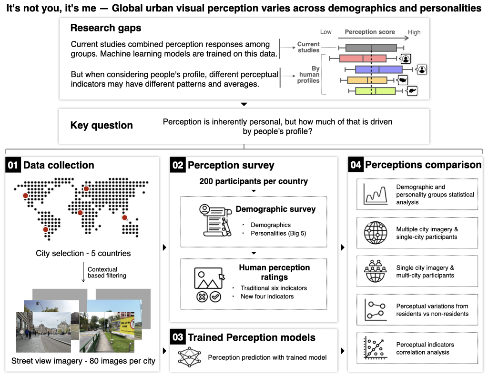

# It's not you, it's me: Global urban visual perception varies across demographics and personalities

This repository is the official implementation of [Global urban visual perception varies across demographics and personalities](https://arxiv.org/abs/2505.12758).

## Requirements

To install requirements:

```
python install -r requirements.txt
```

## Dataset
This work uses a subset of images from the [Global Streetscapes dataset](https://huggingface.co/datasets/NUS-UAL/global-streetscapes).
We provide the Street Perception Evaluation Considering Socioeconomics (SPECS) dataset in [hugging face](https://huggingface.co/datasets/matiasqr/specs).
After downloading its contents in `data/` the folder should have the following subfolders:

```
data
|
|- global-streetscapes (download contextual data from original repo)
|- labels
|- svi
```

## Methodology


### City and image selection
The [wiki](https://github.com/matqr/specs/wiki) in this repository has the steps to reproduce the image subset used.

### Survey reporting parameters
Survey design guidelines proposed by [Gu et al. 2025](https://doi.org/10.1016/j.landurbplan.2025.105368).

| Section | Reporting Parameters | Ours |
|---------|---------------------|------|
| Survey Structure | Design, allocation, consistency evaluation | Our survey consisted of a demographic section of 11 questions and 50 pairwise comparison questions. |
| Raters | Demographics, sample size, number of ratings per image, recruitment process | We recruited 1,000 respondents (200 from each country) who reside in the city, or neighboring cities, where the images were extracted -- Santiago, greater Amsterdam area, Nigeria, Singapore, and San Francisco and Santa Clara -- and are above 21 years old. An equal distribution of respondents, based on annual income range, was prioritised for all but Chile and Nigeria. The gender ratio is 1:1 within countries, and the age group ratio is roughly 1:1:1:2 for 21-29, 30-39, 40-49, and above 50. More than 78% of participants from each country have lived there for more than five years, and less than 5% have lived there for less than a year. Background information from all participants is shown in Appendix Table: participants-bg in Appendix: participants-bg. Each participant completed 50 ratings, with each image receiving an average of 25 ratings (min. 10, max. 46) per indicator. |
| Scoring | Scoring methodology, rationale for method selection, evaluative indicators | We selected pairwise comparison as the ranking scoring method due to its proven stability over and fairly quick assessment. On the online survey, participants were asked to choose their preference between two images given an indicator. To avoid a forced choice scenario that could lead to bias (forced-choice), and to be consistent with previous and future studies, the option for an equally rated preference (i.e., "Both are the same to me") was shown too. We asked participants to rate a random pair of images five times for each of the 10 indicators, making up the 50 ratings per participant. Fig. screenshot-ui shows a screenshot of the online survey. |
| Image | Image type, image source, rationale for image choice, dataset composition | We chose perspective images with good quality, no reflection, non-panoramic, captured in clear weather, and taken during the day with front or back view direction. These types of images have proven rating stability (Gu 2025) and are easily obtained from open data sources. Using the Global Streetscapes, a large open, labelled, processed, and worldwide street-level imagery dataset ([Hou et al. 2024](https://doi.org/10.1016/j.isprsjprs.2024.06.023)); we obtained 400 images, 80 from each city -- Santiago, Amsterdam, Abuja, Singapore, and San Francisco, for subjective ratings in the survey. |


### Pre-processing
The notebook `6_preprocessing.ipynb` takes the collected raw data, creates the demographic subgroups, computes the personality scores, and formats .

## Anlyses

### Demographic and personality statistical analysis

Notebooks with the prefix `7' analyse the statistical differences (Welch's Anova and Games Howell posthoc test) between demographic and personalities groups.
The list of demographics subgroups analysed within countries are

- Gender
- Age group
- Annual Household Income (AHI)
- Education
- Race and ethnicity
- Big 5 personality

Groups are made based on the specific demographic categories, see the Supplementary Information in the paper for more details, as well as interactions between demographic groups.
For personalities, only responses form participants whose personality score is in the 25th quantile and 75th quantile are used for comparisons.

The `.ipynb` notebooks perform the Q Score calculations and generates the `csv` files  and the `R` scripts perform the statistical tests and generate the plots used in the paper.

### Inferred perception scores
A model pretrained on the PlacePulse2.0 (PP2), referred to as ViT-PP2, dataset is used to infer the perception values of the SVI on this dataset.
These inferred scores and compared against the dataset scores for each city.
The script `8_inference.py` is the same [codebase](https://github.com/ualsg/global-streetscapes/tree/main/code/model_training/perception) used in the Global Streetscapes.

Run
```
python 8_inference.py
```

### Multi-ciy SVI & sinle-city participants
The notebook `9a_multiplecitySVI-singlecityparticipant.ipynb` computes the perception Q scores based on participants' location.
The full statistical analysis and figure used on the paper are done with `9a_multiplecitySVI-singlecityparticipant_plots.R`.

### Single-city SVI & multi-city participants
The notebook `9b_singlecitySVI-multiplecityparticipant.ipynb` computes the perception Q scores using all participants' ratings.
The full statistical analysis and figure used on the paper are done with `9b_singlecitySVI-multiplecityparticipant_plots.R`.

### Perceptual variation from residents vs non-residents
The notebook `9c_perceptual-variations.ipynb` computes the perception Q scores based on whether the participants are residents of the images' locations or non-residents.
The full statistical analysis and figures used on the paper are done with `9c_perceptual-variations_plots.R`.

All previous three plots are then merged and polished with `9d_merging_plots.R`.

### Perceptual indicators correlation
The statistical analyses and plots are ran with `10_indicators-correlations_plots.R` (Pearson's correlation) and `10a_indicators-correlations-u-shape.R` (polynomial regressions).

# Paper / Attribution / Citation
If you use our dataset or work, please cite the paper:

BibTeX:
```
@article{TODO
}
```

## Postprint
Besides the published paper, a free version (postprint / author-accepted manuscript) can be downloaded [here](https://arxiv.org/abs/2505.12758).
